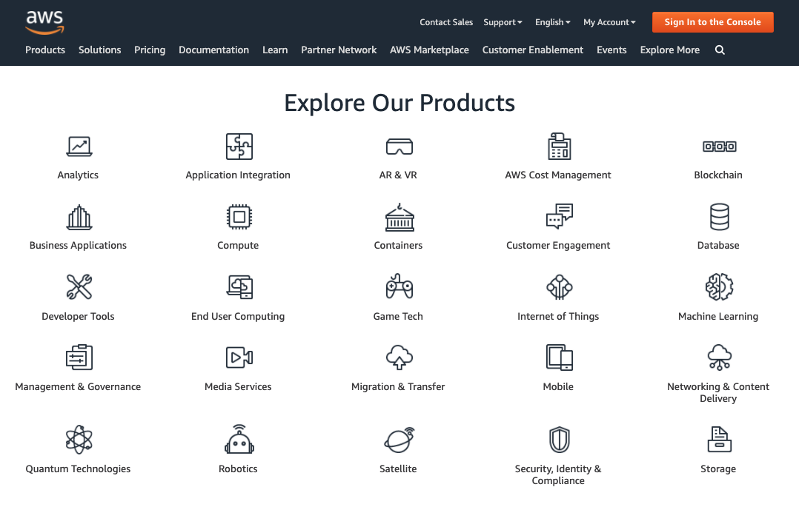

# Introduction to Cloud Computing

## What is cloud computing

### Understanding the cloud

You may have heard of the cloud in the context of storing your photos and videos online, but cloud computing is more than that. It is part of a business model that is becoming increasingly popular with more and more companies moving their workloads to the cloud.

In the video, we introduced you to the world of cloud computing. Let's see how well you understand what it encompasses.

Which statement about cloud computing is false?

Possible Answers: A cloud solution is always better than an on-premise solution.

### Cloud vs. on-premise

The cloud is transforming the way organizations use computer services. Where in the past you had to own local servers and systems, in the cloud they are managed by an external provider that charges you for the use. Let's see if you know the difference.

On-premise

- The servers are located within the physical confines of the company
- It can take along time to set up a new server
- You will pay for the server even when you are not using it

Cloud computing

- Can deal with high website traffic efficiently
- It's easy to scale up or down based on your needs
- You have access to additional computing power instantly

### Cloud computing services

Cloud providers like AWS, Microsoft Azure, and Google Cloud offer a wide variety of services. Below you can find an overview of the products available on AWS.

Which service is included in the AWS offer?

Possible Answers: All of the above

## The power of the cloud

### Primary cloud services

Cloud providers like AWS, Microsoft Azure, and Google Cloud offer a wide variety of services. The three basic ones, which you will be able to find for every cloud provider, are:

- Compute
- Storage
- Databases

It's important to understand what the resources provided by this service are responsible for.

Compute

- These resources provide the brains that will process your workload

Storage

- These resources help you save and store data, like images and text files

Databases

- These resources help you store more structured sets of data, like tables

### Key characteristics

Cloud computing services provide more possibilities for organizations all over the world. These services share certain characteristics that make them very powerful. Time to check how well you understand them!

True

- Most on-premise data centers have a hard time competing with the cloud provider's network of data centers in terms of performance
- With cloud computing you can easily access resources in multiple geographic regions
- On-demand resourcing means that resources are available to you immediateky when you need them
- Virtualization splits one physical server into multiple virtual servers allowing for a more efficient use of the physical resources available

False

- If a hurricane destroys the cloud data center where you're data is store, you lose everything
- Vertical scaling mean adding more machines to your pool of resources
- A cloud solution is always the cheapest option when the resources you need are clear and stable overtime
- Storing your data on the cloud is not secure at all

## Cloud service models

### Outsourcing IT services

Cloud computing is offered in three different service models each satisfying a unique set of business requirements. It's important to understand what each model offers. There are three main service models:

- Infrastructure as a Service (IaaS) - offers cloud infrastructure
- Platform as a Service (PaaS) - offers infrastructure and software for application development
- Software as a Service (SaaS) - offers ready-to-use applications in the cloud

IaaS

- Servers
- Virtualization
- Storage
- Networking

PaaS

- Operating System
- Middleware
- Runtime

SaaS

- Applications
- Data

### IaaS, PaaS, or SaaS?

You proved that you know what is offered in each of these service models, but it's also important to know when to use which one. They all have their own strengths and it is necessary to understand the differences among SaaS, PaaS, and IaaS to know how to best choose one for your organization.

IaaS

- Use case: Improve the capacity of your data center for unpredictable workloads
- Very scalable, less expensive alternative than on-premise infrastructure
- Mostly used by system admins

PaaS

- Easy access to development tools allowing programmers to quickly write and deploy new applications
- Use case: reduce the costs of application development
- Mostly used by developers

SaaS

- Datacamp is an example of this 
- Applcations can be run directly from a web browser without any downloads or installations required
- Most used by end customers
- Use case: trasitioning from internally hosted Exchange email to a cloud-based corporate email tool

### Level of abstraction

Cloud service models can be ordered in terms of abstraction. Abstraction refers to the act of offering essential features without including the background details.

Let's take a look at the three models from before - IaaS, PaaS, and SaaS - as well as a fourth one, FaaS (Function as a Service).

- Software as a Service
- Function as a Service
- Platform as a Service
- Infrastructure as a Service
