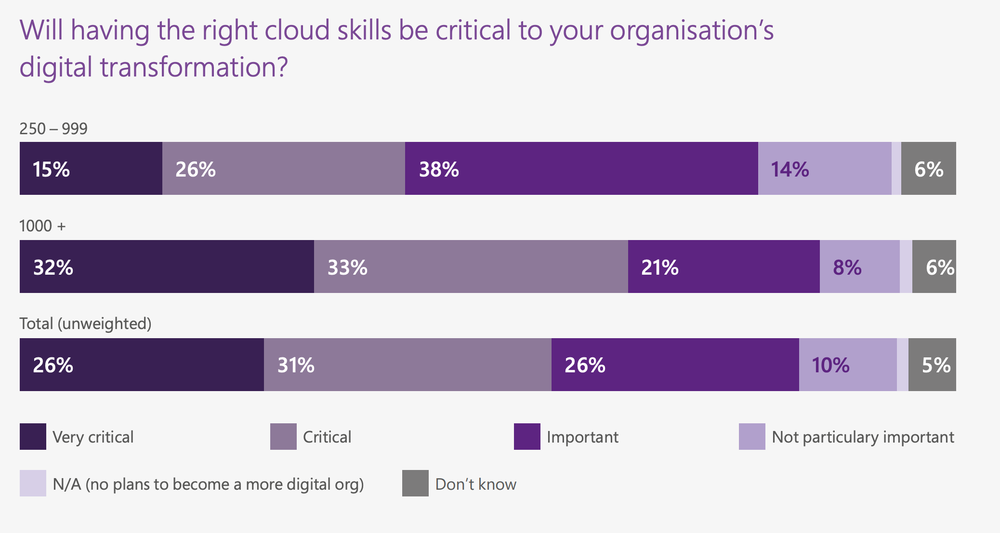

# Cloud Deployment

## Cloud deployment models

### Private or public?

In terms of cloud deployment models, the private model and the public model are on the opposite ends of the spectrum. Therefore, it's crucial to understand the difference between the two. If you know the strengths and drawbacks of each, then you can better decide on the best deployment model for a given use-case, even if it's something in between like the hybrid, community, or multicloud model!

Private Model

- Provides an organization with exclusive use of infrastructure
- Can get direct access to all the data center

Public Model

- Usually has the least unfront time investment
- In cloud bursting, overflow traffic is sent to this model

### Pick the best model

Below are four statements each describing a deployment model and a use-case.

Select the statement that does not describe an appropriate use-case for the given model.

Possible Answers: Hybrid model: Different government agencies need access to tax data

## Regulations on the cloud

### Time limits on storing data 

GDPR has regulations on how long data can be stored. Below is an excerpt from the European Commission describing this regulation:

```
Data must be stored for the shortest time possible. That period should take into account the reasons why your company/organisation needs to process the data, as well as any legal obligations to keep the data for a fixed period of time (for example national labour, tax or anti-fraud laws requiring you to keep personal data about your employees for a defined period, product warranty duration, etc.).

Your company/organisation should establish time limits to erase or review the data stored.
```

How could this rule affect a company using cloud computing?

Possible Answers: If copies of European user data exist on multiple data centers, including disaster recovery backups, companies need to have a robust protocol for making sure every copy is deleted once the time limit elapses.

### Personal data

In the video, we saw a list of data protection regulations around the world. To understand these regulations properly, you need to understand personal data. As a reminder, this is how GDPR defines personal data:

Personal data is any information that relates to an identified or identifiable living individual. Different pieces of information, which collected together can lead to the identification of a particular person, also constitute personal data.

Source

Personal data

- bod@datacamp.com
- Religion
- Genetic data
- Country
- Salary
- Eye color
- Location of birth

Not personal data

- Infor@datacamp.com

## Cloud compputing roles

### Microsoft cloud skills report

In 2017, Microsoft released a "Cloud Skills Report" where they surveyed 250 technical leaders in the UK who are actively involved in recruitment and technical evaluation. The report is publicly available here.

Below is a plot from the report which splits responses between medium sized organizations (250-999 employees) and large-sized organizations (1000+ employees):



What does this plot indicate about cloud skills?

Possible Answers: More than 80% of respondents believe that the right cloud skills will be important or critical to their organization's digital transformation

### Cloud roles

The rise of cloud computing has brought on a new wave of technology roles. In this exercise, each card belongs to a role.

Cloud Architect

- Design cloud infrastructure based on business requirements
- Solutions architect of the cloud

Security Engineer

- Spec out technical security requirements based on regulations and business requirements
- Ensure data privacy of users and the organizationis protected

DevOps Engineer

- Ensure reliability, avaliabilty and scalability through automation
- Experienced in software development and IT operatations
- Maintain infrastructure through code
