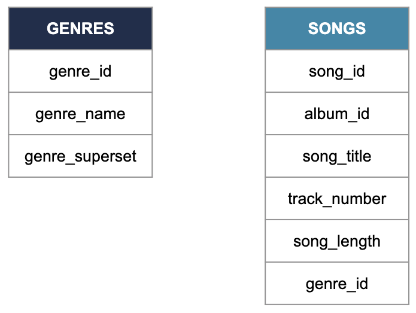

# Storing data

## Data structures

### Structures

In the video, you learned about the three different types of data structure. The less structured the data, the more flexibility there is in how it's stored.

Which of the following statements is false?

Possible Answers: Structured data makes it harder to draw relationships with other data tables.

### What's the difference

You've just learned that data can exist in different structures. Can you correctly define structured, semi-structured and unstructured data?

Structured

- Is created and queried using SQL
- Corresponds to data in tablular format
- Is easy to search and organize

Semi-Structured

- Is moderately easy to search and origanze
- Follows a model while allowing more flexibility than structured data
- Is stored in XML or JSON format or in NoSQL databases

Unstructured

- Is usually stored in data lakes 
- Is diffcult to search and organize
- Stores images, pictures, videos and text

## SQL databases

### We can work it out

Which language is the industry standard to create, update, maintain and query databases?

Possible Answers: SQL

### Columns

Which column allows these two tables to form a relational database?

Possible Answers: The genre_id column

### Different breeds

SQL is the industry standard for Relational Database Management System. In other words, it is to databases what English is to pop music.

However, data engineers and data scientists don't use it the same way. Within the data science team at Spotflix, there are a few tasks that need to be assigned to either the data engineers or the data scientist. Can you help them do that?

Data engineers

- Creating a new table to store the songs customers listened to the most over the past year
- Modifying the whole songs table to remove tralling spaces entered by mistake in front of the title
- Updating an artist's table after they adited their biography

Data scientists

- Quering the artist table to find all the bands that come from France
- Quering the top songs of the past year to identify which genre dominated
- Quering the lyrics table to find all the songs that have 'data' in the title

## Data warehouses and data lakes

### Tell the truth

So far, you heard about data lakes, data warehouses, databases, and you just saw the differences between the three.

Which of the following statements is true?

Possible Answers: A data warehouse is a type of database.

### Our warehouse (in the middle of our street)

Although both are used for data storage, data lakes and data warehouses are used for different purposes and work in different ways.

You will find some statements on the right. Can you correctly classify them, depending on whether they apply to data lakes or data warehouses?

A data lake

- Is mainly used by data scientists and engineers
- Can store structured, semi-structured and unstructured data
- Store draw data
- Is optimized for cost efficiency

A data warehouse

- Is optimized for analysis
- Stores mainly structured data
- Usually stores smaller amounts of data than the other
- Is mainly used by data analysts, business analysts, data scientists and machine learning engineers
