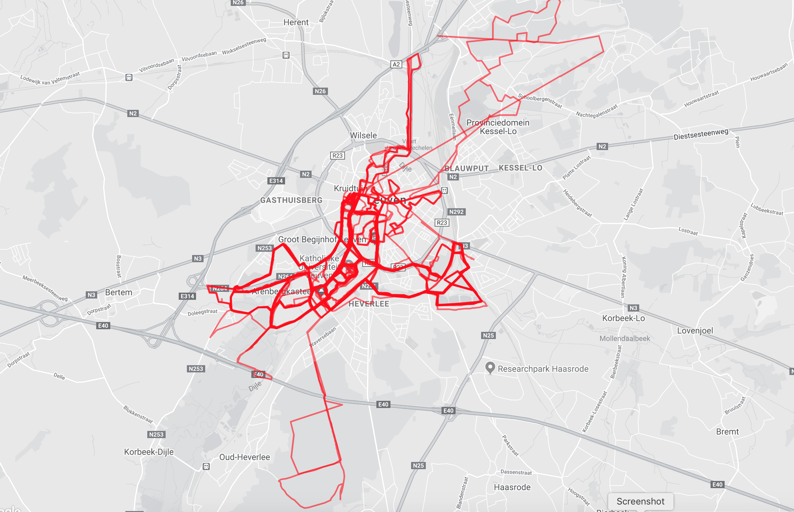

# Data Collection and Storage

## Data sources

### Sorting data sources

Data collection is the first step in the data science workflow. Without data, there wouldn't be any data science. Depending on the project you are working on, you will need different data sources. Consider the following data needs.

Is this data publicly available, or something that is tracked by companies internally?

Company Data

- The number of customer that bought an IPhone in London in December this year
- How likely an Airbnd user is to recommend the website to a friend or colleague
- Number of people clicking on the Coming Soon link on a company website

Open Data

- Number of women between the ages of 30 - 45 living in Miami-Dade Country
- Average household income in Miami-Dade Country
- Stock prices of different beauty brands over time

### Asthma frequencies

You've realized by now that data can come from various sources, and not all of them are publicly available. A data science report contains the following visualization. With your new knowledge of data sources, you are able to identify where the data that's behind it originated.

What source has the data scientist most likely used to collect this data?

Possible Answers

Public records

## Data types

Classifying data types
It's important to know what type of data you have collected. This will be important later on in the data science workflow, when you want to store the data and even later when you will be performing the analyses.

There are two types of data: qualitative data and quantitative data.

Quantitative data

- The daily average temperature in Newyork during 2019
- The individual weight of all the dogs in a shelter
- The maximum speed of formula 1 cars during the 2008 season
- The price of a cup of coffee in Parisian cafes

Qualitative data

- Images of several cats
- The gender of students in STEM fields
- The reviews for a property on Airbnb
- The eye color of people participating in a study

### Net promoter score

Net Promoter Score (or NPS) is a common metric companies use to track the success of a product or website. It’s measured by asking a simple question:

How likely are you to recommend this product or website to a friend or colleague?

Users respond on a scale of 0 - 10 with 0 being not at all likely to recommend and 10 being extremely likely to recommend.

Which of the following best describes NPS data?

Possible Answers

Qualitative data

### Activity tracker

Jane's New Year's resolution this year was to get into the best shape of her life. To help her achieve this goal she decided to invest in an activity tracker. After some months of tracking her activity, there is quite some data available.

The company that manufactured the activity tracker has a public API that allows access to your personal data. Jane is specifically interested in the GPS data of her runs because she wants to make a heatmap showing her most common running routes.

Possible Answers

Geospatial data

## Data storage and retrieval

### Cloud platforms

Jerome has collected a lot of data for a data science project he's working on. His goal is to build a face recognition algorithm and to do that he has collected thousands of images. He needs to decide on which Cloud provider to choose for storing the data.

Which of the following is NOT an example of a Cloud provider?

Possible Answers: SQL Server

### Querying a database

To your right, you'll see a command for selecting some data from the database. You can use the drop-down menus to modify the command. Whenever you want to see the results of the query, click "run query".

Based on your investigation of this database, which of the following statements is most accurate? Complete the following sentence:

This is a ____, and the query is written in ____.

Possible Answers: Relational Database, SQL

### Which type of database?

It's important to understand what type of data you are dealing with because it will affect your storage decision. Some data is tabular and belongs in a Relational Database. Some is unstructured and belongs in a Document Database.

Relational Database

- Customoer information for all students of a university, such as name, phone number, and location
- The dates, times, subjects, and reclplent address for all emails you ever sent

Document Database

- Text from various emails sent and received by you
- Image of differennt traffic events, including metadata about the image's content

## Data Pipelines

### Data pipeline characteristics

Which of the following statements is true?

Possible Answers: Data engineers design and build custom data pipelines for projects.

### Extract Transform Load

Tech companies have complex large-scale data pipelines to deal with the huge amount of data coming from millions of users, whether it's incoming social media posts, viewership data of TV episodes, or recent online purchases.

Imagine the data pipeline of a music streaming service. In this exercise, there are several pipeline tasks listed. Classify those tasks within the steps of ETL.

Extract

- Use the Apple store API t get latest download and rating information
- Collect the latest songs listened t by users on the mobile app

Transform

- Combine data on different users into one dataset for all users
- Group and arrange user listening data by musician

Load

- Store listening data into a database used by machine learning scientists to generate personalized playlists
