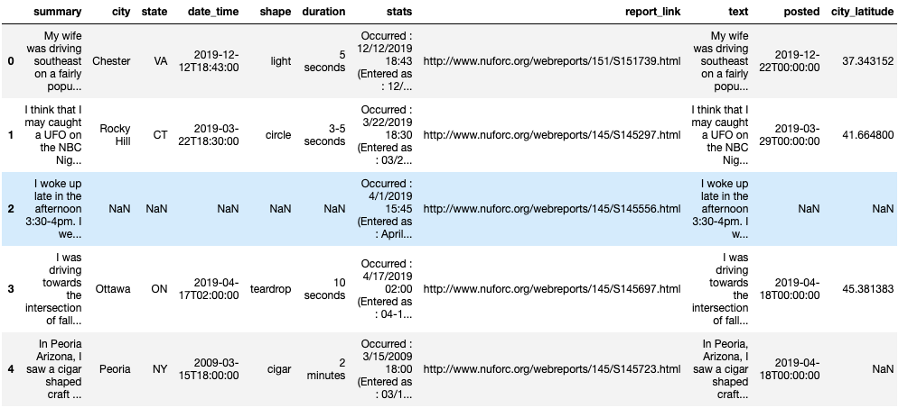
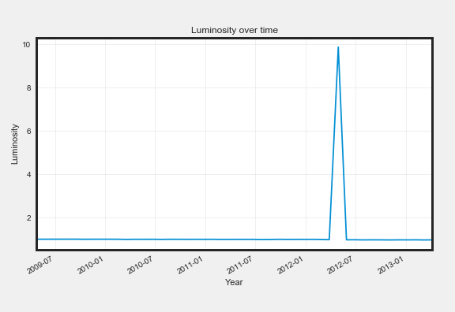

# Preparation, Exploration, and Visualization

## Data preparation

### The truth is out there

Yesterday night, you were stargazing with a friend and you saw something strange in the sky. You decide to look into UFO (Unidentified Flying Object) reports to see if anyone has seen something similar in your area. Luckily, you find a UFO reports dataset, but before analyzing it, you need to prepare the data! Here is a snapshot of the first 5 rows.

Possible Answers:

The third row is full of NaN values, which is unusual. You should try to understand why that is the case before taking the decision to drop or keep it.

### Are you prepared?

Data preparation is a fundamental step, as it directly impacts the feasibility and quality of your analysis and models. There are some statements on the right pane. Some are true, some are false. Can you classify them correctly?

False

- Tidy data means having the features as rows and the observations as column
- Data often comes in a ready to analyze state
- Country names should always be abbrevlated

True

- Non-prepared data can lead to errors, blased algorithms and incorrect results
- Removing duplicates, verifying data types, handlling missing values, ensuring values are encoded using the same standard are part of data preparation
- Missing values are tricky, but there are several ways of deadling with them

## Exploratory Data Analysis

### Numerical EDA

A few years ago, KIC 8462852, also known as Tabby's star, started decreasing strongly in luminosity. We're not sure why yet, but scientists are investigating by recording observations at different times and locations.

Below are some descriptive statistics on the observations. Unlike the qualitative dataset we saw in the video, the Tabby's star dataset is made of quantitative data only, so we get statistics, like the mean and median.

Possible Answers: 52

### Visual EDA

Your friend graphed the star's luminosity using data he copied from public sources. He shows you the graph below. He concludes that scientists have it completely backwards. Scientists say the star is dimming, as the graph shows the luminosity is actually pretty flat, except one moment when it increases a lot.

Which of the following statements is true?

- Something weird is going on. That jump here is probably due to an outlier.

## Viuslization

### Interactive dashboards

Dashboards are great, interactive dashboards are even better. On the right, there is a dashboard made for tracking a website activity. We have the average page visit length segmented by age (top left), the number of visits today (top right), the monthly active users over time (bottom left), and the source of traffic segmented by month (bottom right).

If you hover over bar and line graphs, you will see some interactivity. Using this interactivity, how much website traffic in March was from search engines?

Possible Answers: 0.389

### Improving a dashboard

Here's another dashboard, which you may remember from the first chapter. It's the dashboard of data collected by vibration sensors on the Brooklyn Bridge to measure the amount of traffic. Since the first chapter, you've learned more about visualization, so take a closer look at this dashboard and see if you can come up with some suggestions to improve it.

Which suggestion would you not give?

- The y-axis in the top right "Average Speed" graph needs to start at 0, as opposed to 52.
