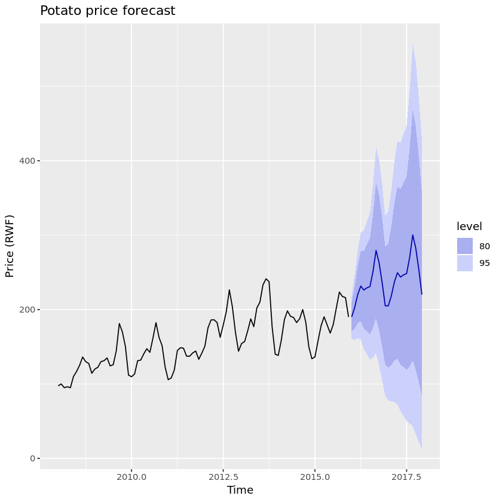

# Experimentation and Prediction

## A/B Testing

### Creating an A/B testing workflow

Darius wants to run an A/B test to test two sets of ad copy for an email campaign. He’s trying to make an ordered to-do list with the correct order of steps for creating his A/B test.

Workflow:

- Picking a metric track
- Calculating sample size
- Running the experiment
- Checking for significance

### Statistical significance

What does it mean if an A/B test result is NOT statistically significant?

- We can't conclude which option is better because the observed difference is likely due to random chance.

### Intermediate results

Alondra is overseeing an A/B test for MeowMail, a subscription service that sends cat food to customers every month.

The A/B test is comparing the original cancellation workflow to a new workflow where the user is shown the amount of money they have saved by using MeowMail and asked if they're sure they want to cancel.

Alondra's team has prepared a slide summarizing the current state of the experiment, which is not yet finished. The slide shows a bar plot with error bars denoting uncertainty. What can Alondra conclude from this slide?

- The number of users exposed to the test has not yet reached the desired sample size, so Alondra should wait and make her judgment after the desired sample size has been reached.

## Time series forecasting

### Classifying time series data

In the previous video, we defined time series data as a series of data points sequenced in time. As we learned, time series data is very useful for analyzing the past and predicting the future.

Below are various examples of data. Indicate whether they can be classified as time series data or not.

Time series data

- Weekly energy consumption
- The price of an airline ticket during different seasons
- Number of steps walked every day for the past year

Not time series data

- Name and address of users
- Geo-spatial data of all the hiking tralls in Yosemite

### Interpret a time series plot

Below is a forecast of potato prices in Rwanda for the years 2016 and 2017.

Which of the following statements is true about the model's prediction?

- The model is 80% confident that the highest the price will peak is 450 Rwandan francs.

## Supervised machine learning

### When to use supervised learning

By now, you've learned about different data science concepts including A/B Testing, Supervised Machine Learning, and Dashboards. Below are a list of problems that need to be solved. Match each problem to the best solution.

A/B Test

- Test which shoes result in a faster marathon time
- Select the menu format the leads to more online users

Supervised Machine Learning

- Based on archived tweets, predict whether a tweet was tweeted by a bot
- Use statistics on past game performance to decide which team is most likely to win the world cup

Dashboard

- Viusally track hourly energy consumption to monitor for high usage

### Features and labels

In the video, you learned that features and labels are key elements in supervised machine learning. Furthermore, it's important to understand the difference between them when building a model.

Juan wants to build a recommendation system that predicts the industry someone works in based on other personal information. Juan has a dataset that he wants to use to train his model. Help him identify which column contains labels.

Possible Answers: Industry

### Model evaluation

Karina is evaluating three different supervised machine learning models for detecting fraudulent bank transactions. Karina knows that one of the weaknesses of the training data was that there are many more examples of valid transactions compared to fraudulent transactions.

To the right, you can see how each model predicted that a transaction was fraudulent or valid compared to how often the transaction actually was fraudulent or valid.

According to this data, which model is the best at detecting both fraudulent and valid transactions, and why?

- Decision tree - it has high rates of accuracy for both valid transactions and fraudulent transactions.

## Clustering

### Supervised vs. unsupervised

These days big companies across all domains now use machine learning to make data-driven decisions. This speaks to the power of machine learning and the many ways it can be applied.

Stacy is a machine learning scientist at a clothing company. She has a list of tasks that need to be completed: some are best suited for supervised machine learning and others are better for unsupervised machine learning. Can you help her organize her tasks? Remember that clustering falls under unsupervised learning!

Supervised

- Predict whether a new clothing style will be successful based on previous season's trends
- Predict if a customer will purchase an item based on what previous customers purchased

Unsupervised

- Create grouping of clothing items that have similar features
- Divide customers into different categories based on their shopping habits

### Cluster size selection

Crystal manages operations for a meal delivery service in Houston, Texas. She has latitude and longitude data for meals requests in the past month. She'd like to create several new "delivery hubs" where demand has been greatest. In order to do this, she's asked a machine learning scientist to use a clustering algorithm to divide the orders into groups based on their location.

The machine learning scientist isn't sure how many clusters to make. On the right, run the algorithm with different numbers of clusters to see the results.

What is the most suitable number of clusters? => 4
