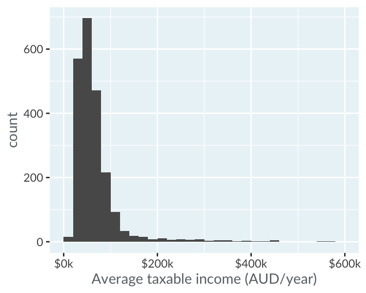
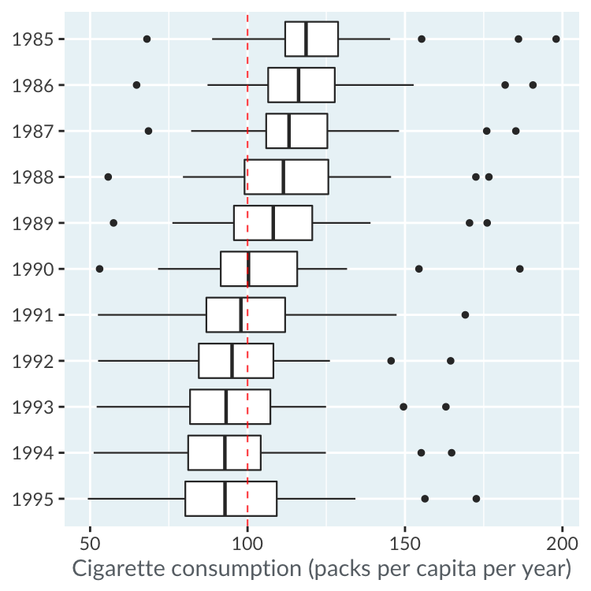

# Visualizing distributions

## A plot tells a thousand words

### Motivating visualization

To get an insight from a dataset, you can calculate summary statistics or run statistical models, but often it's easier to draw a plot.

On the right you can see the price of the bitcoin cryptocurrency from the start of 2016 to the start of 2020. Columns in the table are filterable and sortable.

Look at the bitcoin prices on January the first each year. Which year began with the highest bitcoin price?

Data Source: Coindesk

Possible Answers: 2018

### Continuous vs. categorical variables

In order to choose an appropriate type of plot to draw, you need to be able to distinguish between continuous variables (roughly: "things you can do arithmetic on") and categorical variables (roughly: "things that can be classified").

continuous

- Percentage of questions answered correctly
- Mess squirrels
- Salary of employees
- Population of towns in Canada

categorical

- Job title of employees
- Provinces of town in Canada
- Was the exam passed or failed
- Species of squirrels

## Histograms

### Interpreting histograms

Here is a histogram of salaries for various jobs in Australia. Each row of the dataset is the average salary for that job, so the counts are counts of jobs.

Tip: This left-hand pane of the exercise containing text and instructions is resizable. If the plot is too small to see clearly, making the pane wider will increase the plot size. Move your mouse in-between the the left-hand pane and the drag and drop portion of the exercise so a gray vertical bar appears. In Chrome, click and drag this bar to the right. In Firefox, click the bar, move your mouse right, then click again.

Data Source: Tidy Tuesday

True

- The most popular salary bracket is $40k to $60k
- The histogram us unlmodal
- The histogram is right-skewed

False

- The most popular salary bracket is $569k to $580k
- This histogram is bimodal
- The histogram is left-skewed

### Adjusting bin width

The appearance of a histogram is heavily influenced by the width of its bins: the intervals that determine where each bar lies on the x-axis. If the bins are too wide, you don't see enough detail in the shape of the distribution. If the bins are too narrow, the distribution can be obscured by noise. It's very difficult to know the "best" binwidth, until you physically look at the plot: draw lots of histograms with a range of binwidths until you find one that helps you answer the question.

Here you can see a histogram of agouti (a rodent) sightings from a camera trap on Barra Colorado Island in Panama. When an animal passed the camera, a photo was taken with a timestamp, so the histogram shows the distribution of the time of day when the agouti were most active.

Which of these statements about the agouti activity is true?

Data Source: Rowcliffle et al. 2014

Possible Answers: The agouti were most active for a couple of hours after sunrise (6:30am to 8:30am), and before sunset (4pm to 6m).

## Box plots

### Interpreting box plots

Here are box plots of cigarette consumption per person in the USA from 1985 to 1995 (Alaska and Hawaii are not included). Each observation in the dataset is the average number of packets of cigarette smoked per person in one state in one year. Thus each box plot represents the distribution of 48 data points (because there are 48 US states included in the dataset).

Data Source: Stock, James H. and Mark W. Watson (2003)

True

- The median number of packets of clgarettes smoked per capita was below 100 from 1991 onwards
- The lower quartile number of packets of clgarettes smoked per capita descreased every from 1985 to 1995
- In 1990, three states were considered to have extreme values in the number of packets of clgarettes smoked

False

- The inter-quartile range of the number of packets of clgarettes smoked per capita descreased every from 1985 to 1995
- The upper quartile range of the number of packets of clgarettes smoked per capita descreased every from 1985 to 1995
- The inter-quartile range of the number of packets of clgarettes smoked per capita was smallest in 1992

### Ordering box plots

How you order the box plots affects the kinds of questions that are easy to answer.

Here you can see the US cigarette consumption dataset again. This time each box plot represents the distribution of cigarette consumption over time for a given US state. Thus each box plot is formed from 11 data points representing 1985 to 1995.

By default, the box plots are ordered alphabetically by state name. This makes it really easy to look up the details for a specific state, but difficult to answer questions about where the highest or lowest consumption can be found. Sorting the rows by median cigarette consumption makes those questions are easier to answer.

Inter-quartile range (IQR) measures the variation in the "middle half" of the population (from the 25th percentile to the 75th percentile). That means that sorting by the IQR makes it easier to answer questions about how much variation there was among the "typical" population.

Which statement is false?

Possible Answers: Idaho has the fourth lowest median consumption.
