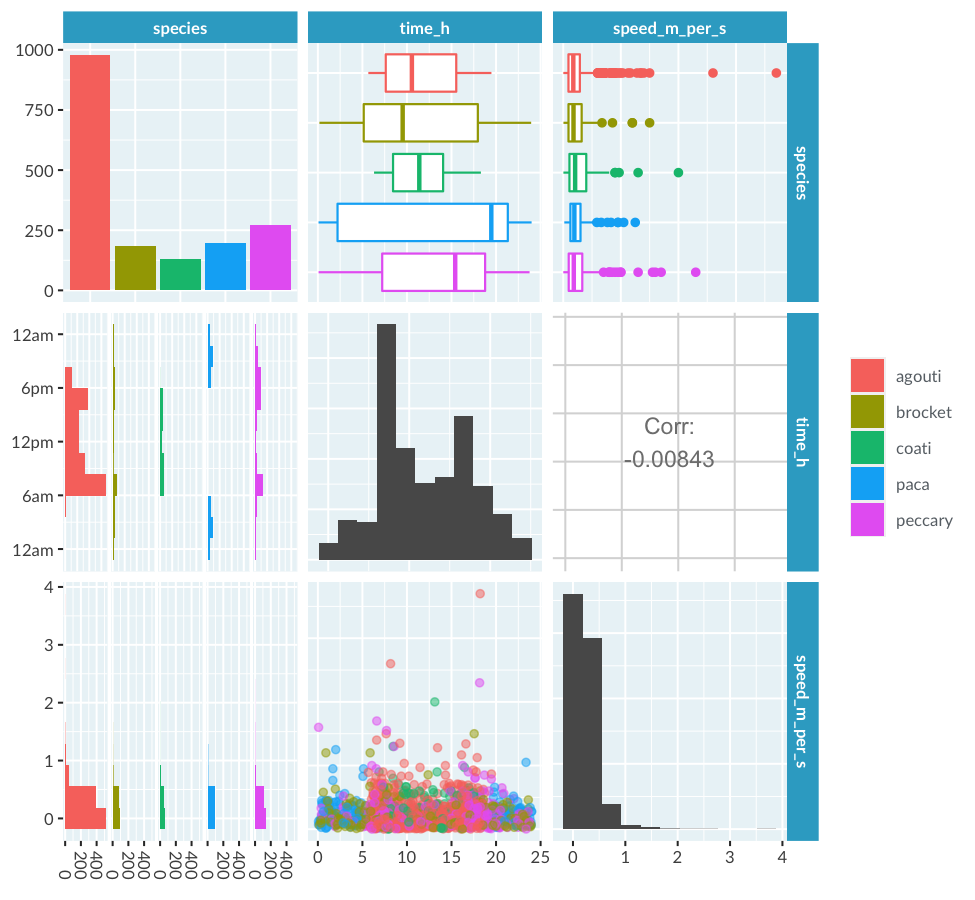
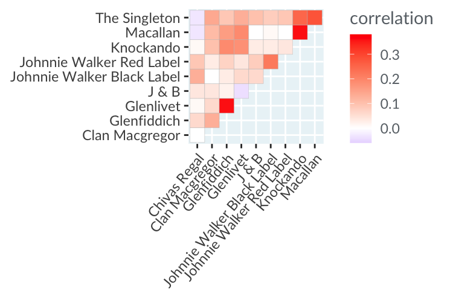
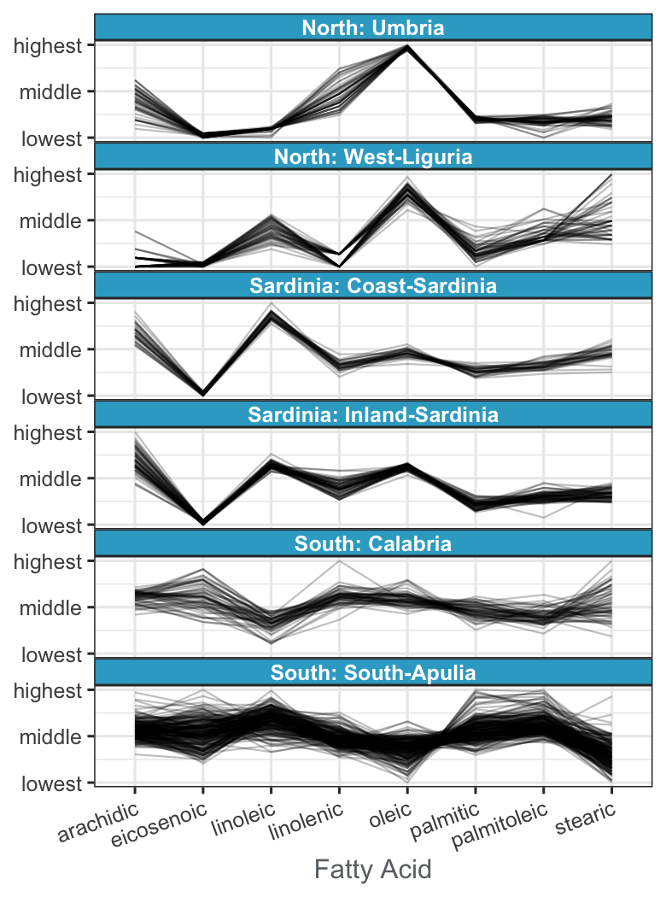

# The color and the shape

## Higher dimensions

### Another dimension for scatter plots

If you have a scatter plot, but want to distinguish the points in some way based on another variable, then you have a few options. As discussed in the video, 3D plots are usually dreadful on a 2D screen, but there are other options to stick to x-y axes and still visualize the third dimension. You can change the color, size, transparency or shape of the points, or split the plot into multiple panels.

Here you can see the dataset of house prices in Los Angeles county, USA, that you first encountered in Chapter 2.

Explore different options for distinguishing points from the four cities, then determine which statement is false.

Possible Answers: Using different shapes provides the best way to distinguish points from each city, but makes it harder to see if there is a single trend across the whole dataset.

### Another dimension for line plots

As with points in a scatter plot, you may often want to be able to distinguish several lines in a line plot. Like points, you can change the colors or transparency level, or use multiple panels. The two differences to points are that you can change line widths rather than point sizes, and you can change linetype (solid, dashes, or dots) rather than point shape.

The line plot shows the stock price for five technology companies collectively known as "FAAMG": Facebook (FB), Apple (AAPL), Amazon (AMZN), Microsoft (MSFT), and Google (GOOG). The prices have been adjusted for dividends and splits, then scaled to be relative to their highest price over the time period so they are more easily comparable.

Explore different options for distinguishing lines from the five companies, then determine which statement is false.

Data source: Yahoo Finance

Possible Answers: All five companies began 2020 with a higher price than they had half way through 2019.

## Using color

### Eye-catching colors

Not all colors are as eye-catching as others. This can cause a problem for data visualization, because having some data point more obvious than others can bias the way you interpret a plot. Unless you specifically want to highlight some points, each data point should be as easy to look at as all the others.

Here you can see the dataset from the camera trap in Panama. This time, the speed of the animal as they passed the camera is plotted against the time of day that they were caught on camera, and the agouti have been joined by another rodent, the paca.

Each version of the plot contains purple and yellow points, but in one version, the purple points are easier to perceive than the yellow points.

Which statement is true?

Possible Answers: To ensure that all data points are equally perceivable, choose a qualitative, sequential, or diverging scale in hue-chroma-luminance colorspace.

### Qualitative, sequential, diverging

There are three types of color scale, each designed to highlight different things in a visualization.

|Type	| Purpose
|---|---|
qualitative |	Distinguish unordered categories
sequential |	Show ordering
diverging	| Show above or below a midpoint

Here you can see the results of a survey about math anxiety from a class of students. Each question has it's own row, and responses range from "Strongly Disagree" to "Neutral" to "Strongly Agree".

Choose an appropriate color scale for the plot.

Data source: Bai et al. (2009)

Possible Answers: Diverging

### Highlighting data

Up to now we've focused on using color and other plot aesthetics to make all data points stand out as much as others. Usually that's a good idea, but occasionally you'll want to highlight specific data points.

Here's the dataset of the greatest hip-hop songs of all time, from Chapter 2. Songs by two rappers at the center of the 1990s East Coast-West Coast hip-hop Rivalry, The Notorious B.I.G. and 2Pac, are colored differently.

Use the sliders to control the highlighting of songs by these artists via point size, transparency, and chroma.

How many songs for each artist made it onto the critics' list?

Possible Answers: The Notorious B.I.G. has 9 and 2Pac has 8.

## Ploting many variables at once

### Interpreting pair plots

To get a quick overview of a dataset, it's really helpful to draw a plot of the distribution of each variable, and the relationship between each pair of variables. A pair plot displays all these plots together in a matrix of panels. It shows a lot of information at once, so to interpret it, try looking at one panel at a time.

Here you can see the Panamanian camera trap data for the agouti and paca, as well as three new species: coati, brocket, and peccary.

True

- Paca is the only nocturnal animal in the dataset
- There are more than 250 sighings of peccary in the dataset
- Most animal were travelling at less than 1m/s when caught on camera

False

- All species were caught on camera most often around dawn (6am) and dusk (6pm)
- The animal with the fastest 75th percentile speend on camera was an agouti
- There is a strong negative correlation between time of sighting and speed of the animal

### Interpreting correlation heatmaps

If you want to find the relationship between many pairs of numeric variables, you can use a close relative of the pair plot, namely the correlation heatmap. It takes the correlation scores you saw from the pair plot, but rather than giving you lots of numbers to look at, it displays them using colors. A great use case for this is finding related products.

Here's a dataset from a survey on scotch whisky consumption. In the correlation heatmap, each row and column shows a brand of scotch, and cells show that correlation between drinking one brand and drinking another within the past twelve months.

Data source: Bayesian Statistics & Marketing

True

- People who drank Glenfddich were also likely to drink Glenlivet
- There was no correlation between drinkers of Clan Macgregtor and drnkers of Chivas Regal
- People who drank The Singleton were unlikely to drink Chivas Regal

False

- People who drank Knockando were unlikely to drink Macallan
- There was no correlation between drnkers of Johnnle Walker Red Label and drinkers of Johnnle Walker Black Label
- People who drank Glenlivet were also likely to drink J & B

### Interpreting parallel coordinates plots

Parallel coordinates plots are designed to help you view the relationship between many continuous variables at once.

Here is a dataset of fatty acid levels in olive oils samples from six regions in Italy. Each line in the plot represents one oil sample. Since the region is a categorical variable, you have six parallel coordinates plots, one in each panel.

Data source: Graphics of large datasets

True

- Oils from both regions in Sardinla have low levels of elcosenoic acid and high levels of lioleic acid
- Oils from Calabria in the South have a wide variety of levels of elcosenoic acid and stearic acid
- Oils from both regions in the North have high levels of oleic acid

False

- Oils from South-Apulla in the South are more consistent in fatty acid levels than other regions
- Oils from West-Liguria in the North have high levels of linoleic acid
- Oils from Inland-Sardinla in Sardinla have a wide variety of levels of oleic acid
