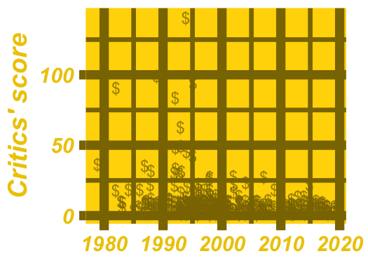

# 99 problems but a plot ain't one of them

## Polar coordinates

### Pie plots

Pie plots (sometimes called pie charts) are extremely popular, but often difficult to interpret. They are just bar plots converted into polar coordinates, and humans are generally worse at perceiving angles accurately compared to lengths.

Following on from the scotch whisky dataset in the last chapter, here's another dataset from the Health Survey for England, this time on alcohol consumption in English men aged 16 or more. Pie segments and bar heights represent percentages of responders.

Look at the pie plot and the bar plot and determine which statement is true.

Possible Answers: All age groups had at least 50% of people drinking up to 14 units per week.

### Rose plots

One good use case for polar coordinates is when the data is naturally circular, for example, when it is a compass direction. If you plot a histogram with polar coordinates, you get a rose plot.

Here you can see a plot of wind direction data from a meteorological mast. Knowing the predominant wind direction is important for weather modeling and for determining where to site wind turbines. Wind measurements were taken at 10 minute intervals over an eight month period.

Look at the histogram and rose plot, then determine which statement is true.

Data Source: bReeze

Possible Answers: The predominant wind directions were N and SW.

## Axes of evil

### Bar plot axes

When we look at a bar plot, we use the relative lengths of each bar to help interpret what is happening. If you don't include zero on the axis used for bar lengths, then the relative lengths of bars are distorted, and it is easy to be misled.

Here is a bar plot of another question from the Health Survey for England, this time about people with asthma. ("Not asthmatic" means no asthma symptoms were reported, and no medication was taken for asthma in the previous 12 months.)

Compare version of the plot with each y-axis, and determine which statement is true.

Possible Answers: The percentage of asthmatics is less than 15% for every age group.

### Dual axes

One popular but terrible idea is to draw a scatter plot or line plot with two different y-axes. This typically happens when you have two metrics with different units, and different scales that you want to plot against a common x-axis. The problem is that by changing the relationship between the two axes, you can tell almost any story that you want with the data.

Here you can see the stock prices of Microsoft (MSFT) and Amazon (AMZN) from 2017 to 2020. When you saw these in Chapter 3, the each price had been adjusted to relative to the maximum for that company. That way each line was comparable. Here, the prices have been adjusted for dividends and splits but they have not been scaled relative to their maxima.

Adjust the vertical position and steepness of the slope for the AMZN line, then determine which statement is true.

Possible Answers: You can't make a conclusion about the correlation of MSFT and AMZN from this plot.

## Sensory overload

### Chartjunk

Chartjunk is anything in a plot that distracts from getting insight. That is, removing it would make the plot easier to understand.

Here's the scatter plot of the greatest hip-hop songs from Chapter 2, this time with added bling.

Which element of the plot is not chartjunk?

Possible Answers: Axis labels

### Multiple plots

Sometimes a dataset is so complex that it takes several plots to explore properly. Rather than trying to find a single, perfect plot that captures all the insight, you can combine several plots into a report or – if you want to have fun – a dashboard.

Here you can see the German Bundesrat (Federal Council) seats dataset in a dashboard of three plots. In the "by party" plots, values are colored according to each party's marketing brand color. The level of transparency is based on power: the primary party in a coalition is fully opaque, secondary parties are slightly transparent, and tertiary parties are very transparent.

Explore the dashboard and determine which statement is false.

Possible Answers: The SPD have more seats as the tertiary party in a coalition than any other party.