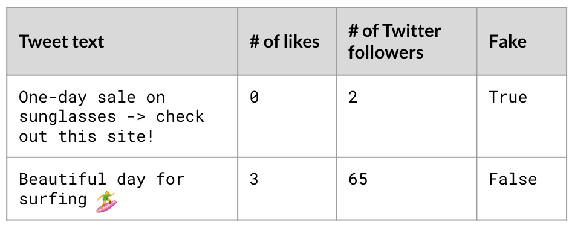

# What is Machine Learning?

## What is Machine Learning

### Recognizing handwritten digits

In machine learning, there's a famous dataset called the MNIST database of handwritten digits. It contains 70,000 images of handwritten digits from 0 to 9. Many models have been made using this dataset to enable computer recognition of handwritten digits. We have one of those models right here for you!

On the left-hand box, you can draw a digit (or something else!) and the model will try to infer the intended digit. On the right, you will see the model's output. To draw a digit, click on plot to start drawing, click again to pause. What does the model's output represent?

Possible Answers: 

- The probabilities that your drawing matches each digit.

### AI, data science, and machine learning walk into a bar...

In the age of big data, AI, data science, and machine learning have become buzzwords that are often incorrectly used interchangeably. They are all related in some way but encompass a different range of methods and goals.

Which of the following statements is FALSE?

- AI and data science share the same goal, but AI uses methods from computer science and data science uses methods from statistics

### What's true about machine learning?

As we saw in the video, there are a lot of headlines about machine learning. Always be cautious because some of it can be sensational. What is true about machine learning?

True

- Machine learning's applcation is not limited to one type of problem or domain
- Machine learning finds patterns in existing data and applies it to new data
- To make predictions from a machine learning model, you need data

False

- Machine learning can only predict what will happen and not explain why something has happended
- Machine learning uses methods from computer science, statistics and physics

## Machine learning concepts

### Machine learning lingo

You overhear a group of data scientists discussing their latest machine learning project on predicting whether a tweet is fake or not. Twitter has provided them with a labeled dataset in hopes of improving their spam detection system.

Here are two observations from the dataset:

Based on this information, classify aspects of their training data as either a feature, label, or target variable.

Feature

- Number of likes
- Number of Twitter followers
- Tweet text

Label

- True
- False

Target Variable

- Fake

### Supervised vs unsupervised

Have you heard of open data? These are datasets that are freely available and governments especially have been pushing initiatives for open public data. For example, here is a snippet of a dataset from California's Open Data portal that looks at educational attainment (i.e., highest degree of education) and personal income.

Each row represents a Californian citizen. It contains the year the citizen completed the survey and the citizen's age, gender, educational attainment, and population count of where they live.

Which of the statements below incorrectly uses the term unsupervised or supervised learning?

- Train a unsupervised machine learning model to predict a citizen's educational attainment level.

## Machine learning workflow

### Steps for building a model

Machine learning is integrated in many of the technologies we use everyday. For example, have you noticed that platforms will have personalized recommendations, whether it's another funny video on Youtube or a book by your favorite author on Amazon? These are "recommender systems" and they typically consist of a machine learning model trained on a user's browsing history.

Imagine the recommender system of your favorite online clothing store. They have data on all the clothes you've viewed and the clothes you ended up buying. This is enough to make a model to output personalized clothing recommendation for you. On the right are tasks to create this model, however, they are incorrectly ordered.

Workflow:

- Extract the features for each product in the shop, including brand, number of times viewed, cost, color, and clothing type
- Split the dataset into 2/3 and 1/3 for the train and test dataset respectively
- Train model using the train dataset and a logistic regression model
- Evaluate the percentage of product in the test dataset that were accurately predicted as bought

### A true step

Below are four statements about each of the steps in the machine learning workflow. Which of them is true?

- Train model: There are many machine learning models to choose from.

