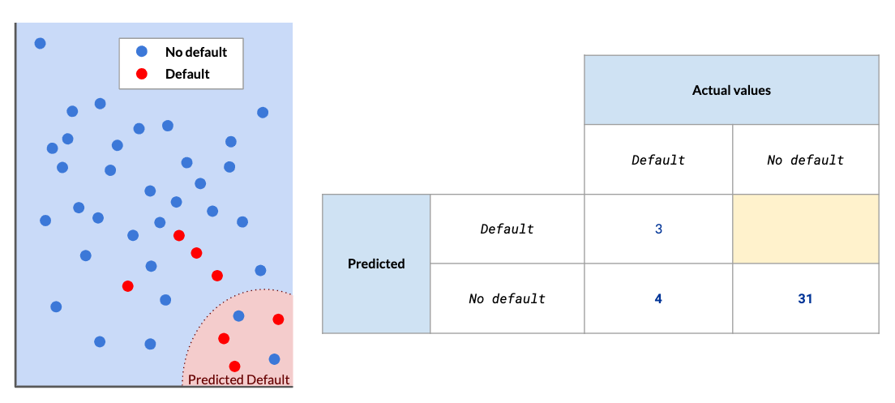

# Machine Learning Models

## Supervised learning

### Warm up

What are the two flavors of supervised learning? => Classification and regression

### Regressing with class

You know there are two flavors of supervised learning: classification and regression. Let's see if you can distinguish between these two types of problems.

Classification

- Based on chemical features (alcohol, pH, chlorides, ...) predict whether a wine is red, white, or rose
- Based on space object attributes (discovery method, orbit, inclination, mass) predict whether this object is an exoplanet or not
- Based on song features (length, key, loudness, tempo, ...) predict a song's genre

Regression

- Based on chemical features (alcohol, pH, chlorides, ...) predict the price of a wine
- Based on people's attributes (level of education, area, job title, age, ...) predict their income
- Based on employee's attributes (seniority, income, department, distance from home, ...) predict how long until an employee looks for another job

## Unsupervised learning

### We don't need no supervision

You now know about supervised and unsupervised learning. Let's see if you can distinguish them.

Supervised

- Based on stock information (open value, highest value, lowest value, close value for each day), preidct its future value
- Based on customer information (sign up date, ordering frequency, age, marital status), preidct their spending amount
- Based on email feature (sender, topic, ratio of uppercased letter, proportion of 'money' term) preidct if an email is spam or not

Unsupervised

- Based on customer information (sign up date, ordering frequency, age, marital status) find segments of customers
- Base on email information (sender, topic, ...) find groups of emails by theme
- Base on customer's purchase history, find which items they are likely to be inerested in next

### Gotta cluster 'em all!

Pokemon Go is a popular mobile game where users find, capture, and train virtual Pokemon characters. These characters are scattered throughout real locations and users have to physically travel to find these characters. Pokemon Go users can battle other users at Pokemon Gyms, which are physical locations with high traffic.

On the right, reported Pokemon sightings in downtown Perth have been plotted according to longitude and latitude. Using clustering and this sighting data, you need to help decide where gyms should open up in downtown Perth.

According to these sightings, how many gyms do you think should be opened up in downtown Perth?

Possible Answers: There's not enough information to decide.

## Evaluating performance

### True or False?

You just learned how to evaluate your model's performance, and how doing so differs depending on the nature of the problem. Let's check if everything is clear.

True

- A False Positive is a value that was predicted as positive, when it's actually negative
- Assessing an unsupervised learning model's performance is trickler and depends on your original objectives
- Confusion matrices are used to evaluate classification performance

False

- A False Negative is a value that was predict as positive, when it's actuallly negative
- Accuracy is always an informative and useful metric

### Land of confusion

Your colleague comes to you with the predictions of a model that predicts whether a bank customer will default on their loan or not. They started filling out the matrix, but they got confused about what goes where.

Can you help your colleague finish their confusion matrix?



Possible Answers: There are 2 false positives.

## Improve performance

### It's a long way to the top

As you've seen, there are several ways to improve your model's performance. We focused on hyperparameter tuning, dimensionality reduction and ensemble methods.

- **Hyperparameter Tuning**
  - While training a Decision Tree, change the minimum count of observation for what constitutes a branch
  - Write a script to try 3 different values of three different hyperparamters of your SVM, and keep configuration that yields the best results

- **Dimensionality Reduction**
  - On a dataset of running sessions to assess a treadmill's longevity, with duration, speed, inclination, remove the column ```calories_burned```
  - Run an analysis  to indentify the four main features that give the best predictions, and get rid of the others

- **Ensemble Methods**
  - Use the most common prediction from an SVM, a K-Means and a Descision Tree model to assign a category to an observation
  - Use the average prediction from a Linear Regression, a K-Means and a Decision Tree model to assign a category to an observation

### Explore hyperparameter tuning

A hyperparameter is a model parameter that is chosen by you before training begins. (This is in contrast to parameters, which are determined by the model training.) The hyperparameters available to set differ between types of model.

Here you see the results of a gradient boosting models (GBMs) that tries to predict whether or not people will vote in an election. GBMs are a type of ensemble model that create lots of regression trees. Hyperparameters for GBMs include the number of trees to generate, the complexity of each tree, and the learning rate (how much weight is given to each tree).

It's usually impossible to know which combination of hyperparameters will result in the best performing model, so you have to try lots of combinations of them.

Use the dashboard controls to change hyperparameters and find the combination that gives the highest accuracy.

Possible Answers: 00 trees, 6 levels of complexity, learning rate 0.01
